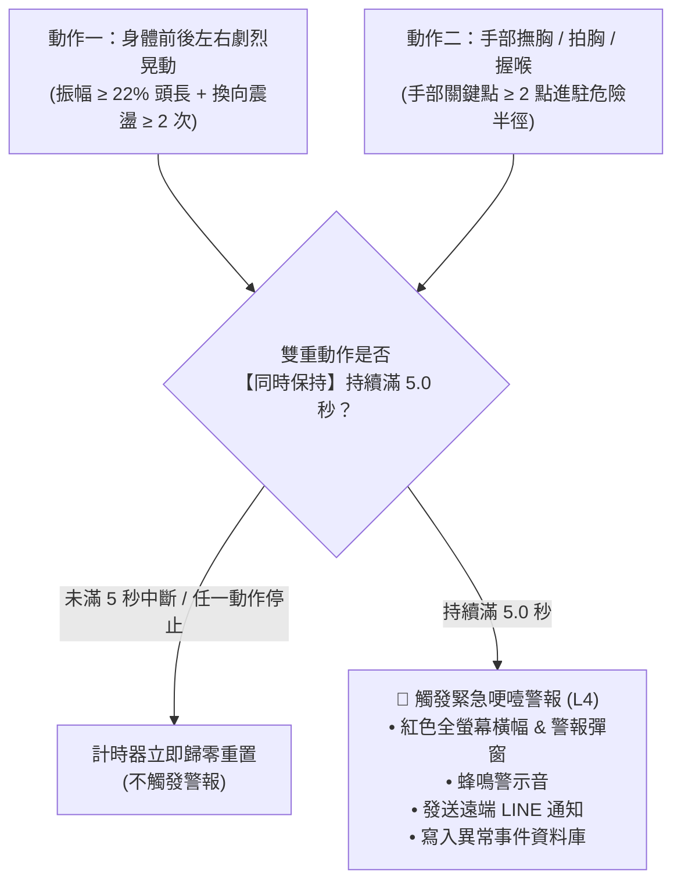

# 🛡️ 防哽咽即時監測系統 —— 任務開發與系統重構紀錄彙整

**彙整時間**：2026-09-11  
**執行項目**：哽噎 L4 晃動嚴格判定、嗆咳靜默後台化、相機端 UI 升級與跨端部署  
**涵蓋端點**：
- 📱 **手機 Web 監測端** (GitHub Pages 線上站點)
- 🖥️ **桌面 Python 邊緣端** (`防哽咽裝置4_2.py` OpenCV / MediaPipe)
- 📊 **遠端照護者儀表板** (`caregiver.html`)
- ☁️ **跨電腦同步資料庫** (`951222-1/html-progress-sync` 進度報告 #0007)

---

## 📌 一、任務需求與修改動機摘要

| 項次 | 原始需求 / 反饋問題 | 處理目標與方向 | 狀態 |
| :--- | :--- | :--- | :---: |
| 1 | **登入選單報錯** `Uncaught ReferenceError: loginAsPatient is not defined` | 修復選單內個案點擊事件，確保 `loginAsPatient` 全域正確綁定與作用域引用。 | ✅ 完成 |
| 2 | **哽噎 (L4) 警報過度敏感** 「手放到胸口和脖子不代表哽咽，一定是要放上去後身體前後左右劇烈晃動，才能觸發警報。」 | 徹底剔除「無聲窒息」、「多模態融合旁路」、「單純摸脖子滿 5 秒」等容易誤報的直接觸發機制，強制要求**劇烈搖晃 ＋ 手在胸前/喉嚨雙重動作同時持續滿 5 秒**。 | ✅ 完成 |
| 3 | **L1/L2 嗆咳事件靜默化** 取消劇烈晃動條件，僅背景寫入 SQLite / LocalStorage（標籤為「嗆咳紀錄」），不跳 UI 彈窗、不閃紅橫幅。 | 將咳嗽事件自「阻斷式警告」降級為「背景醫療護理事件日誌」，消除長者用餐時的驚慌干擾。 | ✅ 完成 |
| 4 | **停用發呆警報** 「發呆警報4秒這邊要改掉，就不要偵測了」 | 移除咀嚼停頓或發呆 4 秒未吞嚥的警報，尊重長者個人自主咀嚼與休息節奏。 | ✅ 完成 |
| 5 | **相機端 UI/UX 升級** 新增個案帳號功能（姓名/性別）、隱藏長者不需要看到的技術資訊、新增嗆咳紀錄檢視面板。 | 於登入彈窗增加「➕ 新增個案」輸入表單；隱藏技術 HUD 覆蓋面板；增加「📋 嗆咳紀錄」歷史檢視視窗與計數徽章。 | ✅ 完成 |
| 6 | **跨端同步與發布** 網址端與桌面端同步更新。 | 透過 `deploy_mobile_web.py` 發布至 GitHub Pages，同步修改桌面端 `防哽咽裝置4_2.py`。 | ✅ 完成 |
| 7 | **進度報告生成與 AI 同步** 依 SOP 上傳同步報告至 GitHub。 | 透過 `ai_sync.py push` 完成序號 `#0007` 之 HTML 報告同步與遠端索引更新。 | ✅ 完成 |

---

## 🚨 二、哽噎（L4）緊急警報演算法重構

### 1. 誤報根因剖析與移除之旁路機制
在過去版本中，系統為了避免遺漏任何意外，設置了數個非晃動觸發管道，導致一般日常行為（如摸脖子、發呆張嘴、拿湯匙停頓）產生大量誤報：
1. **移除無聲窒息（Silent Choke）直接跳警報**：原先演算法在嘴巴微張（`MAR > 0.15`）且下巴靜止持續數秒時，會判定為窒息並彈出緊急警報。此機制已被停用。
2. **移除多模態證據融合（Evidence Fusion）直接跳警報**：原先演算法中，只要手部靠近脖子便累積 0.6 分，若環境有微小聲響即超過 0.8 門檻引發 L4 警報。此機制已徹底移除。
3. **移除單純撫頸滿 5 秒跳警報**：原先演算法只要手觸碰脖子滿 5 秒即跳警報。

### 2. 唯一合法觸發標準：雙重動作同時持續滿 5 秒
系統現在**僅有且必須同時滿足**以下兩項高特異性行為特徵，且持續不中斷滿 5.0 秒，方能觸發 L4 哽噎警報：

#### 特徵量化指標：
* **身體劇烈晃動判定 (`checkContinuousBodyShaking`)**：
  - 追蹤鼻尖關鍵點位移，採比例無因次化計算：
    $$\text{norm\_disp} = \frac{\Delta \text{pos}}{\text{face\_height}}$$
  - 位移門檻拉高至 $\ge 22\%$ 頭高，每步位移步幅 $> 3.0$ px。
  - 增加**反向震盪檢驗**（Direction Reversals $\ge 2$ 次），徹底排除長者單次低頭喝湯或抬頭看人的單向移動。
* **胸前／喉嚨手勢判定 (`handNearChestOrThroat`)**：
  - 喉嚨半徑：$0.50 \times \text{face\_height}$
  - 胸口半徑：$0.85 \times \text{face\_height}$
  - 手部至少有 2 個關節點落入範圍內方認定為有效撫胸/握喉。
* **持續計時器**：
  - 只有在 `isBodyShakingContinuous && isHandOnChestOrThroat` 兩者皆為 `true` 時，計時器才會遞增。
  - 只要其中任一動作停止，計時秒數立即重置為 `0.0` 秒。

---

## 📋 三、嗆咳事件與狀態機調整

### 1. 嗆咳事件（L1/L2）改為後台靜默紀錄
* **調整原因**：長者用餐時偶爾輕微嗆到或咳嗽屬常見生理反應，若每次咳嗽都跳出全螢幕阻斷視窗與刺耳警報，會造成進食者高度焦慮。
* **運作機制**：
  - 偵測到咳嗽特徵（聲音頻譜咳嗽模型或影像下巴頭部急抽動）時，**取消任何劇烈晃動的綁定條件**。
  - **不跳彈窗、不閃紅橫幅、不發 LINE 通知**。
  - 背景自動寫入 SQLite 資料庫（標籤名：`嗆咳紀錄`）及前端 LocalStorage，並在畫面上方的嗆咳計數徽章 `+1`，方便照護團隊餐後檢視。

### 2. 徹底移除 4 秒發呆警報
* 原先設計於長者張嘴咀嚼超過 4 秒未完成吞嚥時觸發「發呆警報」。
* 現已將該偵測模組全數關閉，長者可依自身步伐細嚼慢嚥。

---

## 📱 四、被照護者相機端 UI/UX 重構

### 1. 登入錯誤修復 (`loginAsPatient`)
* **修復方式**：將 `loginAsPatient` 綁定於全域 `window` 物件，並在個案點擊按鈕時正確傳入個案代碼與姓名，確保點選任何個案皆能順暢登入開始監測。

### 2. 快速新增個案帳號表單
* 進入首頁點選「➕ 新增個案」即可展開基本資料填寫介面：
  - **姓名 / 稱呼**：例如「王爺爺」、「陳奶奶」。
  - **性別**：單選「男」或「女」。
* 點擊「儲存並開始監測」後，系統自動指派代號（如 `P004`），存入本機清單並立即完成登入切換。

### 3. 「📋 嗆咳紀錄」獨立檢視面板
* 頂部導航列常駐「📋 嗆咳紀錄」按鈕與計數徽章。
* 點擊後開啟 Modal 視窗，即時條列：
  - 發生時間（日期、時:分:秒）
  - 事件類型（例如：聲音咳嗽特徵、影像急抽動嗆咳）
  - 當前餐次總累計次數
  - 支援「清空紀錄」功能。

### 4. 介面視覺清爽化
* 隱藏畫面中央的技術偵測數據覆蓋層（MAR 嘴唇開合度、Jaw 移動標準差、手勢狀態等除錯數字）。
* 畫面保持簡約，僅呈現鏡頭取景、當前狀態提示與必要之緊急通報按鈕。

---

## 💻 五、修改檔案與核心程式碼清單

### 1. 手機端 Web 程式碼
* **`mobile_web/index.html`**：
  - 新增新增個案視窗表單（`patient-add-view`）、`saveAndLoginNewPatient()` 邏輯。
  - 新增「📋 嗆咳紀錄」彈窗（`cough-record-modal`）、`recordCoughEvent()`、`renderCoughRecords()`。
  - 將 `#hud-stats-overlay` 加上 `hidden` 類別進行隱藏。
  - 全域定義 `window.loginAsPatient`。
* **`mobile_web/app.js`**：
  - 嚴格重構 L4 觸發條件，移除非晃動之旁路邏輯。
  - 升級 `checkContinuousBodyShaking` 晃動位移演算法。
  - 將咳嗽判定導向背景靜默存檔，關閉發呆計時警報。

### 2. 桌面端 Python 程式碼
* **`桌面版_學生註解/防哽咽裝置4_2.py`**：
  - 註解並關閉行 724-753 的 `silent_detector`（無聲窒息）與 `evfusion`（多模態融合）的 `trigger_emergency_popup` 彈窗。
  - 保留行 903-914 唯一具備晃動特徵之「雙重動作滿 5 秒」緊急哽噎警報。
  - 保留行 894-901 的靜默後台 SQLite 嗆咳紀錄寫入。

---

## 🌐 六、線上部署與跨電腦同步紀錄

### 1. GitHub Pages 官方正式站點更新
- **被照護者相機端**：
  👉 [https://951222-1.github.io/html-progress-sync/mobile/index.html](https://951222-1.github.io/html-progress-sync/mobile/index.html)
- **遠端照護者控制台**：
  👉 [https://951222-1.github.io/html-progress-sync/mobile/caregiver.html](https://951222-1.github.io/html-progress-sync/mobile/caregiver.html)

### 2. AI 跨電腦同步系統 (`ai_sync.py`)
- **發布報告序號**：`#0007`
- **報告標題**：`哽噎L4劇烈晃動嚴格判定與相機端UI升級`
- **同步儲存庫**：`951222-1/html-progress-sync`
- **儲存檔案**：`data/html/0007_哽噎L4劇烈晃動嚴格判定與相機端UI升級.html`
- **執行結果**：`[SUCCESS] 成功建立並上傳進度報告 #0007！`
